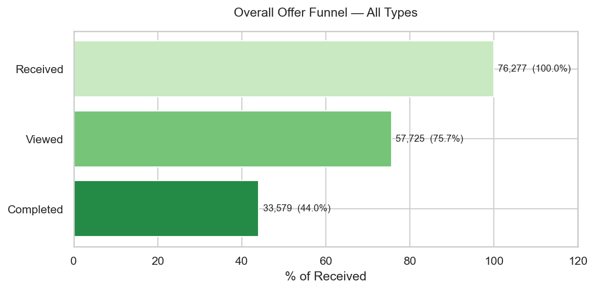
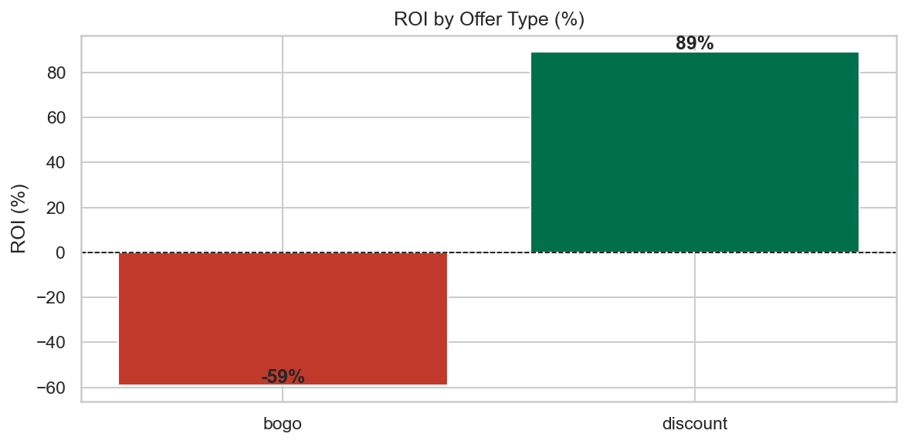

# Promo Effectiveness Analysis — Starbucks Capstone

**Stack:** Python · pandas · scipy · statsmodels · matplotlib/seaborn · Jupyter

---

## Business Question

> *How are offer views, completions, and observed revenue associated with promotional exposure across customer segments?*

---

## Executive Summary

| Offer Type | Observed completion difference | Best Segment | Observed reward/revenue ratio |
|---|---|---|---|
| **Discount** | **+84.6%** | Low-income / Age 35–44 | **+89%** |
| BOGO | +33.9% | Age 35–44 | −59% |
| Informational | n/s | — | n/a |

**Key findings:**

1. Discount has the strongest observed association with completion in this dataset.
2. BOGO has a higher observed reward cost relative to the analyzed revenue proxy.
3. Informational offers do not generate offer-completion events by design.
4. Customers who viewed offers had a higher observed completion rate; this can reflect selection bias.
5. Exposed and non-exposed customers differ in observed spend, which is a hypothesis for a randomized experiment.

**Interpretation limit:** these results are observational associations, not causal estimates. Viewing is a post-exposure behavior, so viewers can systematically differ from non-viewers. They are useful for forming prioritization hypotheses, but incremental lift and causal ROI require randomized assignment.

---

## Visual results





The complete analysis also includes customer demographics, conversion differences, segment heatmaps, spend comparisons, and the isolated randomized-experiment module in notebooks `01` through `05`.

---

## Dataset

**Starbucks Capstone Challenge** — simulated data mirroring real Starbucks customer behavior.

| File | Rows | Description |
|---|---|---|
| `portfolio.json` | 10 | Offer metadata: type (BOGO/discount/informational), spend requirement, reward, duration, distribution channels |
| `profile.json` | 17,000 | Customer demographics: age, gender, income, membership start date |
| `transcript.json` | ~306,000 | Event log: offer received, offer viewed, offer completed, transaction (amount) |

After cleaning (removing 2,175 customers with missing demographics):
- **14,825 valid customers**, **16,994 with at least one offer event**
- **115,609 offer-level rows** across 10 distinct offers
- **Average transaction value: $12.78**

**Download:** [Kaggle — Starbucks Capstone Dataset](https://www.kaggle.com/datasets/blacktile/starbucks-app-customer-reward-program-data)  
Place the 3 JSON files in `data/raw/`.

---

## What Are We Doing?

### The Core Problem

Starbucks sends promotional offers to app users. Not every customer sees every offer, and not every offer type works equally well for every customer. We want to measure:

1. Is viewing a promotion **associated** with a higher completion rate?
2. Which offer type is **most effective**?
3. Which customer segments **respond best**?
4. Which offer has the strongest **observed revenue-versus-reward scenario**?

### Pipeline

```
data/raw/*.json
     │
     ▼ python main.py
  Extract + Transform + Save
  (src/extract.py → src/transform.py → data/processed/*.parquet)
     │
     ▼ jupyter lab
  Notebooks 01 → 05
```

---

## Statistical Methods Explained

### Observational analysis vs. randomized experiments

These two concepts are **related but distinct**:

| | Randomized A/B testing | Hypothesis testing |
|---|---|---|
| **What it is** | Random assignment to variants | A statistical inference framework |
| **Question answered** | What is the causal effect of assignment? | Is an observed difference compatible with chance under a model? |
| **Output** | Causal lift, if design assumptions hold | p-values, test statistics, decisions |
| **Available here** | No — assignment is not available in this dataset | Yes, for observational associations |

This dataset does not expose random treatment assignment or a valid holdout group. Viewed-versus-not-viewed comparisons are therefore observational. A p-value measures sampling uncertainty under a model; it does not remove selection bias, confounding, or the post-treatment nature of viewing. Causal lift and incremental ROI need a separately randomized experiment.

---

### Control and Treatment Groups

There is no pure holdout group in this dataset. We use the closest proxy:

| Group | Definition | Rationale |
|---|---|---|
| **Not viewed** | Received offer but **did not view** it | Observational comparison group; not an organic control |
| **Viewed** | **Viewed** the offer | Observational comparison group; can differ before viewing |

---

### Statistical Tests Used

#### Z-Test for Proportions
Used to compare two conversion rates.

- **When to use:** Binary metric (converted/not), large samples (n > 30 per group)
- **H₀:** The two conversion rates are equal
- **p-value:** Probability of observing this difference if H₀ were true. If p < 0.05, reject H₀.

#### Welch's t-Test
Used to compare average spend between groups.

- **When to use:** Continuous metric, groups may have unequal variances
- **Why Welch's:** Does not assume equal variance — more robust than Student's t-test
- **H₀:** Mean spend is equal in both groups

#### Chi-Squared Test of Independence
Used to test whether offer completion is associated with gender.

- **When to use:** Two categorical variables
- **H₀:** The variables are independent (no association)

#### Bonferroni Correction
Running 4 tests at α = 0.05 gives ~18.5% chance of at least one false positive. Bonferroni divides the threshold by the number of tests: adjusted α = 0.05 / 4 = **0.0125**.

---

### Uplift

$$\text{Uplift}_{\text{relative}} = \frac{\text{Rate}_{\text{treatment}} - \text{Rate}_{\text{control}}}{\text{Rate}_{\text{control}}} \times 100\%$$

---

### ROI

$$\text{Observed scenario ratio} = \frac{\text{Revenue proxy} - \text{Campaign Cost}}{\text{Campaign Cost}} \times 100\%$$

- **Revenue proxy** = observed completion-rate difference × viewed customers × avg ticket ($12.78)
- **Campaign Cost** = total rewards paid to completers
- This is not incremental causal revenue or causal ROI; it is an observed scenario estimate.

---

## Attribution model and data quality

`offer_events` is an `offer_exposure` table with exactly one row for each `offer received` event. It contains `exposure_id`, `person`, `offer_id`, `time_received`, `valid_until`, first eligible view/completion timestamps, flags, and attributed reward.

- A view or completion must occur after the send and before `valid_until`.
- For overlapping sends of the same offer, the event is assigned to the last eligible exposure.
- A view or completion event can be assigned only once.
- The pipeline fails fast if an offer sent in the transcript has no duration in the portfolio.
- Tests cover repeated sends, expiration, input-order independence, overlapping windows, missing events, and reward reconciliation.

### Synthetic causal module

`src/causal.py` contains the separate workflow required for causal claims: known random assignment, an assigned-treatment proportion test, and a sample-size plan for a selected minimum detectable effect. Its generated data is synthetic and is never mixed with the observational Starbucks transcript analysis.

---

## Results

### Hypothesis Tests

| # | Hypothesis | Test | Result | p-value | Decision |
|---|---|---|---|---|---|
| H1 | Viewing offer → higher conversion (35.4% → 62.2%) | Z-test | +75.8% uplift | ≈ 0 | **Reject H₀** |
| H2 | BOGO > Discount conversion | Z-test | Discount wins (79.7% vs 67.3%) | 1.0 | Fail to Reject H₀ |
| H3 | Exposed customers spend more ($95 → $108) | Welch's t | +$12.17 / +12.8% | ≈ 0 | **Reject H₀** |
| H4 | Completion depends on gender | Chi-squared | χ²=1712.8 | ≈ 0 | **Reject H₀** |

H1, H3, and H4 remain significant after Bonferroni correction (adjusted α = 0.0125). H2 is not significant.

### Uplift by Segment (Top 5 — Discount offers only)

| Segment | Control Conv. | Treatment Conv. | Uplift |
|---|---|---|---|
| Low income | 29.0% | 78.0% | **+169.4%** |
| Age 35–44 | 34.7% | 85.5% | **+146.2%** |
| Age 25–34 | 33.5% | 81.6% | **+143.8%** |
| Age < 25 | 34.1% | 79.2% | **+132.4%** |
| Mid income | 36.0% | 81.5% | **+126.5%** |

### ROI by Offer Type

| Offer Type | Observed revenue proxy | Reward cost | Observed net scenario | Observed scenario ratio |
|---|---|---|---|---|
| Discount | $185,890 | $98,220 | **+$87,670** | **+89%** |
| BOGO | $96,285 | $234,765 | **−$138,480** | **−59%** |
| Informational | $0 | $0 | $0 | n/a |

---

## Notebooks

| Notebook | Focus | Key Output |
|---|---|---|
| `01_eda.ipynb` | Data structure, quality, distributions | Funnel rates, demographic charts |
| `02_ab_testing.ipynb` | Experiment design, group comparison, observed lift | Conversion by group and offer type |
| `03_hypothesis_testing.ipynb` | Z-test, t-test, χ², Bonferroni correction | p-values, significance decisions |
| `04_uplift_segmentation.ipynb` | Uplift by gender, age, income, heatmaps | Top-responding segments ranking |
| `05_roi_analysis.ipynb` | Observed revenue-versus-reward scenario by offer type, channel, segment | Prioritization hypotheses |

---

## Project Structure

```
promo-effectiveness-analysis/
├── data/
│   ├── raw/                    ← Starbucks JSON files (not versioned)
│   └── processed/              ← Parquet outputs from main.py
├── notebooks/
│   ├── 01_eda.ipynb
│   ├── 02_ab_testing.ipynb
│   ├── 03_hypothesis_testing.ipynb
│   ├── 04_uplift_segmentation.ipynb
│   └── 05_roi_analysis.ipynb
├── src/
│   ├── constants.py            ← Paths, alpha, bins
│   ├── extract.py              ← Load raw JSON files
│   ├── transform.py            ← Clean, merge, feature engineering
│   └── utils/
│       ├── stats.py            ← Z-test, t-test, chi-squared, ROI, Bonferroni
│       └── plot.py             ← Reusable chart helpers
├── tests/
│   ├── test_transform.py       ← attribution and transform tests
│   └── test_causal.py          ← synthetic causal-module tests
├── reports/
│   └── figures/                ← Charts exported from notebooks
├── main.py                     ← Run ETL once before opening notebooks
└── requirements.txt
```

---

## Setup

```bash
pip install -r requirements.txt
python main.py          # ETL: raw JSON → data/processed/*.parquet
python -m jupyter lab   # open notebooks 01 → 05 in order
```

To run tests:
```bash
python -m pytest tests/ -v
```

The suite contains 22 automated tests covering attribution, data-quality rules, and the isolated synthetic causal module.

---

## Tech Stack

| Layer | Tool |
|---|---|
| Data processing | pandas, numpy, pyarrow |
| Statistical tests | scipy, statsmodels |
| Visualization | matplotlib, seaborn |
| Notebooks | JupyterLab |
| Testing | pytest |
